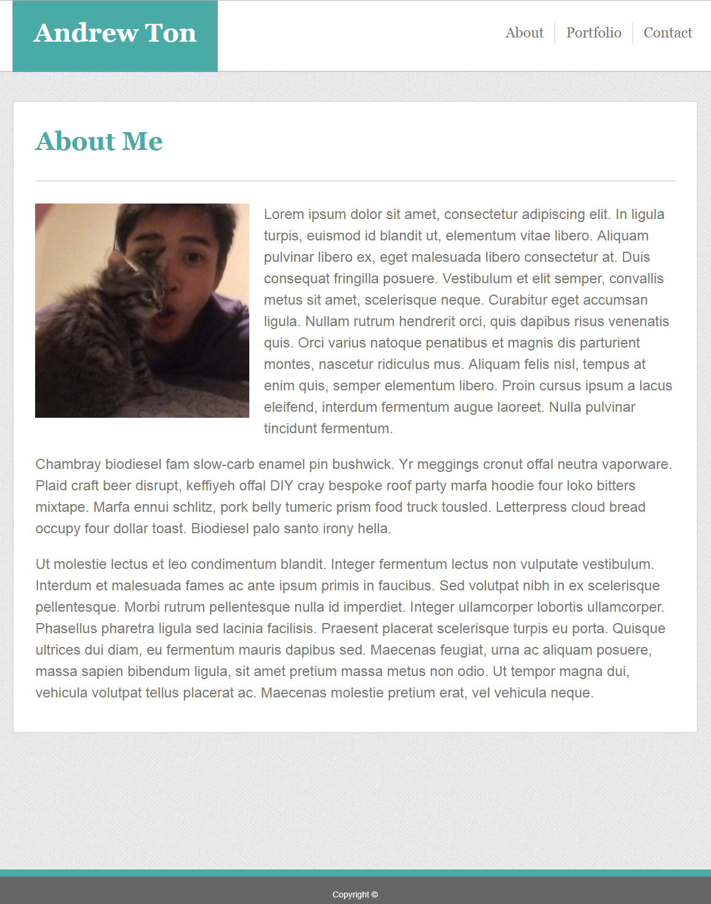
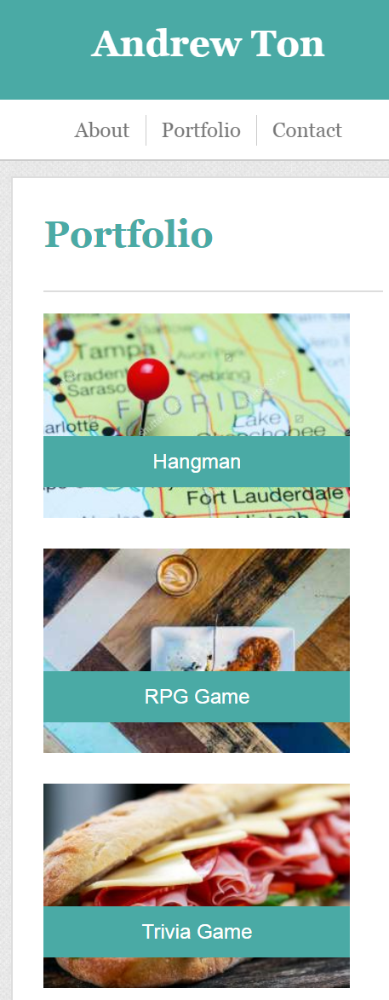

<!-- Put the name of the project after the # -->
<!-- the # means h1  -->
# HW-Responsive-Portfolio

<!-- Put a description of what the project is -->
Project to add media queries to portfolio site.

# Link to deployed site
<!-- make a link to the deployed site --> 
<!-- [What the user will see](the link to the deployed site) -->
[GitHub Repository](https://github.com/atton88/Responsive-Portfolio)

[Website](https://atton88.github.io/Responsive-Portfolio/)

# Images
<!-- take a picture of the image and add it into the readme  -->
<!--  -->



# technology used
<!-- make a list of technology used -->
<!-- what you used for this web app, like html css -->

<!-- 
1. First ordered list item
2. Another item
⋅⋅* Unordered sub-list. 
1. Actual numbers don't matter, just that it's a number
⋅⋅1. Ordered sub-list
4. And another item. 
-->

- HTML
- CSS

# code snippets
<!-- put snippets of code inside ``` ``` so it will look like code -->
<!-- if you want to put blockquotes use a > -->

Media Query
```
@media screen and (max-width:980px) {

    .contentbox{
        width: 800px;
        margin-left: 60px;
        margin-right: auto;
        margin-top: 140px;
    }
    
    nav {
        margin-left: 60px;
        width: 800px;
    }
}
```

# Learning points
<!-- Learning points where you would write what you thought was helpful -->
Learned basic website elements like headers, footers, panels, forms, and horizontal lists, as well as formatting the elements.

- Learned to add media queries to websites and check them using the developer tools on the browser.


# Author 
<!-- make a link to the deployed site and have your name as the link -->
[Andrew Ton](https://github.com/atton88)

# License
Standard MIT License